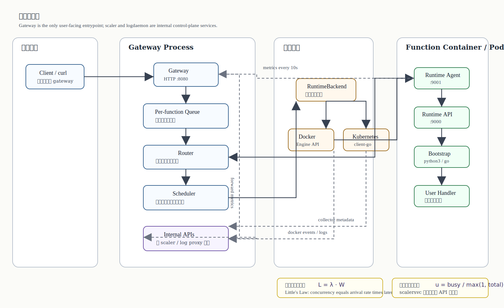
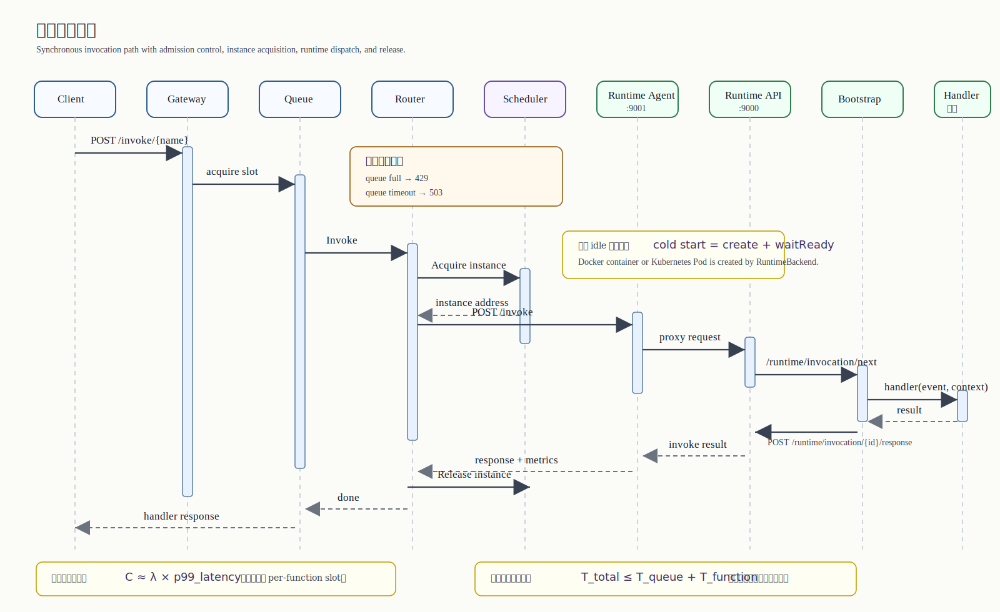
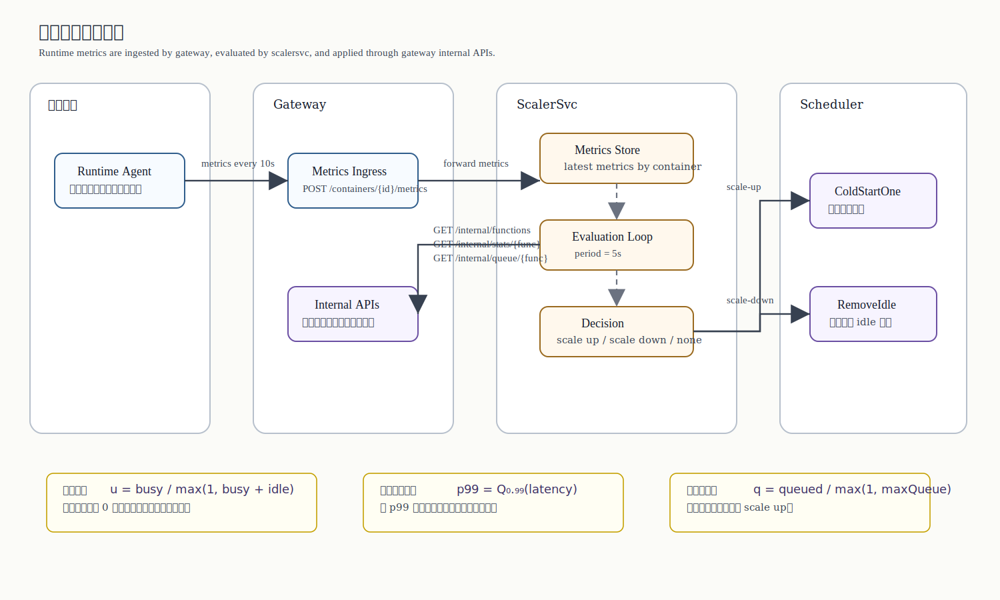
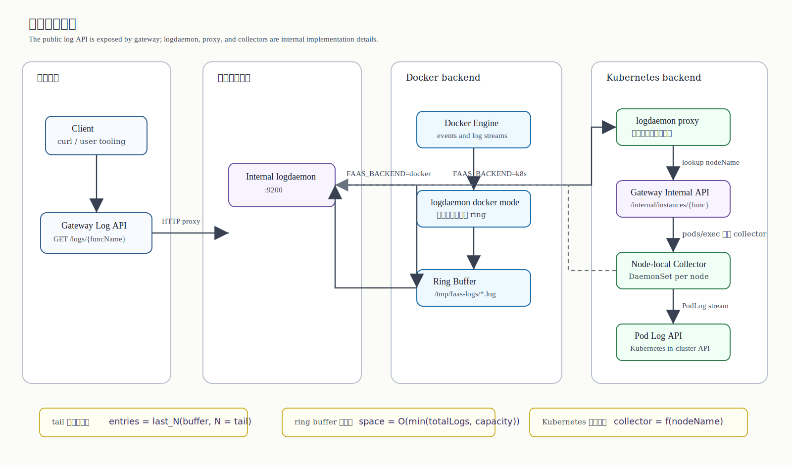

# Local Serverless / FaaS Learning Project

这是一个用于学习 AWS Lambda 架构思想的本地 FaaS 系统。项目从最小 gateway 开始，逐步加入 Docker/Kubernetes 运行后端、Runtime API、函数代码上传、runtime-agent、日志 daemon、独立 autoscaler，以及 gateway 入口层的请求队列和背压。

当前实现目标不是生产可用，而是把一个 serverless 平台的关键控制面和数据面拆开，方便理解每个组件为什么存在、它们之间如何协作，以及后续要补哪些能力才能接近主流开源 FaaS 平台。

## 这是什么

这个项目适合用来理解一条完整的本地 FaaS 调用链路：

- gateway 如何接收函数管理与调用请求
- scheduler 如何复用实例、触发冷启动、管理双后端
- runtime-agent 和 runtime-server 如何把平台请求交给用户 handler
- scalersvc 如何根据 queue / p99 / error rate 做扩缩容判断
- gateway 如何统一承载函数管理、调用和日志查询入口

如果你把它当成“一个可读、可跑、可逐步扩展的 serverless 平台骨架”会比较合适。

## 快速开始

### Docker 后端

```bash
cd /Users/z/serverless
./start.sh
./test.sh
./stop.sh
```

### Kubernetes / minikube 后端

```bash
minikube start
cd /Users/z/serverless
PATH="$PATH:$HOME/.local/bin" FAAS_BACKEND=k8s ./start.sh
PATH="$PATH:$HOME/.local/bin" MAX_REPLICAS=10 FAAS_BACKEND=k8s ./test.sh
PATH="$PATH:$HOME/.local/bin" FAAS_BACKEND=k8s ./stop.sh
```

如果你只想先读懂项目，建议先看：

- [`LEARNING_PATH.md`](LEARNING_PATH.md)
- [`gateway/README.md`](gateway/README.md)
- [`runtime/README.md`](runtime/README.md)

## 当前能力

- 函数注册、注销、代码 zip 上传。
- Docker 或 Kubernetes Pod 作为函数运行沙箱。
- 容器内实现 Lambda 风格 Runtime API。
- Python handler 动态加载和执行。
- runtime-agent 负责请求转发、健康检查、指标采集和周期上报。
- gateway 提供统一日志查询入口，logdaemon 在内部负责 Docker 日志采集，Kubernetes 下采用 node-local collector + host proxy 查询链路。
- scalersvc 独立运行，收集 agent 指标并按默认策略扩缩容。
- gateway 内置 per-function 请求队列和背压。
- 本地一键启动、停止和端到端测试脚本。

## 先看哪里

### 想先运行起来

- [`SCRIPTS.md`](SCRIPTS.md)
- `./start.sh`
- `./test.sh`
- `./stop.sh`

### 想先理解整体架构

- 当前架构图
- 请求调用链路
- 指标与扩缩容链路
- 日志采集链路

### 想直接读源码主线

- [`gateway/main.go`](gateway/main.go)
- [`gateway/scheduler/scheduler.go`](gateway/scheduler/scheduler.go)
- [`runtime/cmd/agent/main.go`](runtime/cmd/agent/main.go)
- [`runtime/cmd/runtime/main.go`](runtime/cmd/runtime/main.go)
- [`scalersvc/main.go`](scalersvc/main.go)
- [`logdaemon/shared.go`](logdaemon/shared.go)

## 文档索引

### 组件文档

- [`gateway/README.md`](gateway/README.md)：gateway 入口、queue、router、scheduler、双后端实现。
- [`runtime/README.md`](runtime/README.md)：runtime-server、runtime-agent、Python bootstrap、容器内调用链路。
- [`scalersvc/README.md`](scalersvc/README.md)：指标接收、扩缩容策略、决策循环、内部接口协作。
- [`logdaemon/README.md`](logdaemon/README.md)：docker / collector / proxy 三种模式与日志查询链路。

### 学习与运维文档

- [`LEARNING_PATH.md`](LEARNING_PATH.md)：按总览 → gateway → runtime → scaler → logdaemon → scripts 的顺序阅读整个项目。
- [`SCRIPTS.md`](SCRIPTS.md)：`start.sh`、`stop.sh`、`test.sh` 的职责、执行流程、环境变量与排障说明。

## 目录结构

```text
serverless/
├── gateway/
│   ├── main.go                 # HTTP API 入口，连接 router、scheduler、queue、scalersvc
│   ├── queue/queue.go          # per-function 请求队列与背压
│   ├── scheduler/scheduler.go  # 函数注册表、容器池、冷启动、释放、回收
│   └── scheduler/*_backend.go  # Docker / Kubernetes 双后端
├── runtime/
│   ├── cmd/runtime/main.go     # 容器内 Runtime API server
│   ├── cmd/agent/main.go       # 容器内 runtime-agent
│   ├── bootstrap/python3_bootstrap.py
│   ├── examples/python/handler.py
│   └── entrypoint.sh
├── scalersvc/main.go           # 独立自动扩缩容服务
├── logdaemon/main.go           # 独立日志采集 daemon
├── Dockerfile                  # runtime 镜像
├── start.sh                    # 构建并启动完整系统
├── test.sh                     # 端到端测试
└── stop.sh                     # 停止服务和函数容器
```

## 当前架构图



## 请求调用链路



## 指标与扩缩容链路



## 日志采集链路



## 核心组件说明

### Gateway

Gateway 是系统唯一用户入口，监听 `:8080`，负责对外暴露函数管理、调用和日志查询接口：

- `POST /functions/{name}`：注册函数。
- `DELETE /functions/{name}`：注销函数并停止相关容器。
- `PUT /functions/{name}/code`：上传 zip 代码包。
- `POST /invoke/{name}`：调用函数。
- `GET /queues/{name}`：查看函数请求队列状态。
- `GET /logs/{funcName}`：用户查询函数日志，gateway 同步代理到内部 logdaemon。
- `POST /containers/{id}/metrics`：接收 runtime-agent 指标并转发给 scalersvc。
- `/internal/*`：给 scalersvc 调用的内部控制接口。

### Queue / Backpressure

`gateway/queue` 在 gateway 入口处按函数名做隔离：

- `MAX_INFLIGHT_PER_FUNCTION`：单函数最大并发执行数，默认 `5`。
- `MAX_QUEUE_PER_FUNCTION`：单函数最大排队数，默认 `100`。
- `QUEUE_TIMEOUT_MS`：请求排队最长等待时间，默认 `30000`。

行为：

- 有空闲 in-flight slot：立即进入 router。
- in-flight 满但队列未满：进入等待队列。
- 队列满：返回 `429 queue full`。
- 等待超时：返回 `503 queue timeout`。

这个组件对应 Knative queue-proxy / API gateway backpressure 的简化版，目的是防止 gateway 无限堆积请求或无限触发容器冷启动。

### Router

Router 是同步调用路径：

1. 检查函数是否注册。
2. 读取请求 body。
3. 调用 scheduler 获取容器。
4. 将请求转发到容器内 runtime-agent 的 `/invoke`。
5. 将 handler 结果返回给客户端。
6. 调用 scheduler 释放容器。

### Scheduler

Scheduler 管理函数注册表和容器池：

- 默认 runtime 镜像：`faas-runtime:latest`。
- 默认 handler：`handler.handler`。
- 默认 timeout：`30s`。
- 默认 memory：`128MB`。
- idle 容器优先复用。
- 没有 idle 容器时通过当前 RuntimeBackend 冷启动 Docker 容器或 Kubernetes Pod。
- 上传新代码后停止旧容器，下次调用使用新代码。
- 定期回收长时间 idle 容器。

### RuntimeBackend

Scheduler 通过 `RuntimeBackend` 抽象创建和停止函数实例，目前支持两种后端：

- `FAAS_BACKEND=docker`：默认后端，通过 Docker Engine HTTP API 创建本地容器，并映射到宿主机端口。
- `FAAS_BACKEND=k8s`：Kubernetes 后端，面向 minikube，通过 client-go 创建 Pod，并用 SPDY port-forward 让 gateway 访问 Pod 内 runtime-agent。

上传代码会先解压到本地 `/tmp/faas/{name}`。当配置 MinIO 时，scheduler 还会保存 zip 对象并记录 `CodeKey`/`CodeURL`；Kubernetes 后端优先用 initContainer 从 presigned URL 下载代码并解压到 `/function`，只有没有对象存储信息时才回退到旧的 minikube hostPath 同步路径。Scheduler 还会记录实例所在 `nodeName`，供 logdaemon proxy 按函数实例路由到对应 node collector。

### Runtime API Server

每个函数容器内运行 `runtime-server`，监听 `:9000`，实现 Lambda 风格 Runtime API：

- `POST /invoke`：接收 agent 转发的调用请求。
- `GET /runtime/invocation/next`：语言 bootstrap 长轮询获取下一次调用。
- `POST /runtime/invocation/{requestId}/response`：bootstrap 上报成功结果。
- `POST /runtime/invocation/{requestId}/error`：bootstrap 上报错误结果。

Runtime server 会启动用户函数 bootstrap 进程，并在进程退出后自动重启。

### Python Bootstrap

Python bootstrap 负责：

1. 读取 `FUNCTION_HANDLER`，如 `handler.handler`。
2. 将 `/function` 加入 `sys.path`。
3. 动态 import 用户 handler。
4. 长轮询 Runtime API 获取事件。
5. 执行 `handler(event, context)`。
6. 将响应或错误发回 Runtime API。

### Runtime Agent

runtime-agent 运行在每个函数容器内，监听 `:9001`，是 gateway 访问容器的入口：

- 代理 `POST /invoke` 到 runtime server。
- 代理 `GET /health` 到 runtime server。
- 暴露 `GET /metrics`。
- 记录 invocation count、success、error、p50/p95/p99 latency。
- 读取 cgroup v2 memory 和 cpu 使用量。
- 每 10 秒向 gateway 上报指标。

### ScalerSvc

scalersvc 独立运行，监听 `:9300`，通过 HTTP REST 与 gateway 通信：

- `POST /metrics/{containerID}`：接收 gateway 转发的 agent 指标。
- `GET /scale/{funcName}`：查看扩缩容状态。
- `GET /health`：健康检查。

默认策略：

- scale-up：任一条件满足即可扩容。
  - utilization >= `80%`
  - p99 latency > `500ms`
  - error rate > `10%`
- scale-down：条件同时满足才缩容。
  - utilization < `20%`
  - p99 latency < `100ms` 或没有指标
  - idle replicas 大于 min replicas

### LogDaemon

logdaemon 是内部日志采集服务，监听 `:9200` 供 gateway 调用；用户通过 gateway 的 `GET /logs/{funcName}` 查询日志。它按后端分两种实现：

- `FAAS_BACKEND=docker`：单进程 docker mode，通过 Docker socket 收集日志。
- `FAAS_BACKEND=k8s`：宿主机运行 proxy mode，Kubernetes 内每个 node 跑一个 collector mode DaemonSet。

Docker 模式下：

- 监听带 `faas.function` label 的 Docker container events。
- 启动时也会 attach 已存在的 FaaS 容器。
- 读取 stdout/stderr 日志流。
- 维护 per-function ring buffer。
- 写入 `/tmp/faas-logs/{funcName}.log`。
- gateway 代理 `GET /logs/{funcName}?tail=10` 到内部 logdaemon。

Kubernetes 模式下：

- collector 通过 ServiceAccount 直连 in-cluster Kubernetes API，不依赖 collector 容器内安装 `kubectl`。
- collector 只跟随本 node 上、带 `faas.managed-by=local-faas` 的函数 Pod 日志。
- proxy 通过 gateway `/internal/instances/{funcName}` 获取函数实例和 `nodeName`。
- gateway 把 `/logs/{funcName}` 查询交给内部 proxy，proxy 再定位对应 collector。
- collector 同样维护 node-local ring buffer，并暴露 `/local/logs/{funcName}` 供 proxy 查询。

## 本地运行

### 依赖

- Go
- Docker Desktop
- minikube（仅 `FAAS_BACKEND=k8s` 需要）
- kubectl（仅 `FAAS_BACKEND=k8s` 需要）
- curl
- zip / unzip
- python3

### 启动完整系统（Docker 默认后端）

```bash
cd /Users/z/serverless
./start.sh
```

### 启动完整系统（Kubernetes / minikube 后端）

```bash
minikube start
cd /Users/z/serverless
FAAS_BACKEND=k8s ./start.sh
```

Kubernetes 后端会执行 `minikube image load faas-runtime:latest`。函数 Pod 由 client-go 创建，gateway 通过 SPDY port-forward 连接 Pod 内 runtime-agent，因此 gateway 仍可在宿主机上运行。

在 `FAAS_BACKEND=k8s` 下，`start.sh` 还会：

- 交叉编译 Linux 版 `logdaemon` 到 `bin/logdaemon-linux`。
- 把 collector 二进制同步到 minikube node 的 `/tmp/faas-bin`。
- 应用 `k8s-logdaemon.yaml`，部署 `faas-log-collector` DaemonSet、ServiceAccount 和 RBAC。
- 在宿主机启动 `LOGDAEMON_MODE=proxy` 的内部 logdaemon，gateway 通过它查询 collector 日志。

`start.sh` 会执行：

1. 构建 gateway、scalersvc、logdaemon。
2. 交叉编译 Linux arm64 runtime-server、runtime-agent 和 collector 用的 `logdaemon`。
3. 构建 runtime Docker 镜像。
4. 清理旧服务和旧函数实例。
5. k8s 模式下部署 log collector DaemonSet。
6. 启动 gateway、scalersvc、logdaemon。
7. 等待三个服务健康检查通过。

### 运行端到端测试

```bash
cd /Users/z/serverless
./test.sh
```

测试覆盖：

- gateway / scalersvc / logdaemon 健康检查。
- 注册 `hello` 函数。
- 上传 Python handler zip。
- 冷启动调用。
- 热调用复用容器。
- 查询 queue 状态。
- 查询 scale 状态。
- 等待 runtime-agent 指标上报。
- 注入高 p99 指标触发 scale-up。
- 验证 queue backlog 触发扩容。
- 查询函数日志。

### 停止系统

```bash
cd /Users/z/serverless
./stop.sh

# Kubernetes 后端
FAAS_BACKEND=k8s ./stop.sh
```

## 重要接口

### Gateway

```bash
curl -X POST http://localhost:8080/functions/hello \
  -H 'Content-Type: application/json' \
  -d '{"handler":"handler.handler"}'

zip -j /tmp/hello.zip runtime/examples/python/handler.py
curl -X PUT http://localhost:8080/functions/hello/code \
  --data-binary @/tmp/hello.zip

curl -X POST http://localhost:8080/invoke/hello \
  -H 'Content-Type: application/json' \
  -d '{"name":"Alice"}'

curl http://localhost:8080/queues/hello
```

### Internal scaler debug

scalersvc 监听 `:9300`，但它是内部控制面服务。普通用户操作都应通过 gateway；直接访问 scaler 只适合本地调试自动扩缩容：

```bash
curl http://localhost:9300/scale/hello
```

### Logs

```bash
curl 'http://localhost:8080/logs/hello?tail=10'
```

## 与主流 FaaS 架构的关系

这个项目与 AWS Lambda、OpenWhisk、Knative、OpenFaaS 等系统有相似的核心概念，但实现被压缩到本地学习场景：

| 能力 | 当前项目 | 主流 FaaS |
|------|----------|-----------|
| API Gateway | Go gateway | API Gateway / Activator / Controller |
| 函数运行环境 | Docker 容器 / Kubernetes Pod | Firecracker / containerd / Kubernetes Pod |
| Runtime API | 自研简化版 | Lambda Runtime API / OpenWhisk runtime contract |
| 函数代码管理 | zip 上传到本地目录 | 对象存储、镜像仓库、版本发布系统 |
| 调度 | 单机 scheduler | 多节点 scheduler / Kubernetes scheduler |
| 扩缩容 | 独立 scalersvc | KEDA / Knative autoscaler / OpenWhisk controller |
| 日志 | 自研 logdaemon | Fluent Bit / CloudWatch / Loki / Elasticsearch |
| 背压 | gateway queue | queue-proxy / activator / broker |
| 隔离 | Docker container | microVM、sandboxed container、gVisor、Kata |

## 当前已知限制

- Kubernetes 后端当前面向 minikube，本地 gateway 通过 Pod port-forward 访问 runtime-agent，不是生产 datapath。
- 未设置 `MONGO_URI` 时函数元数据只在内存中；设置 Mongo 后函数配置可持久化，但运行中的容器/Pod 仍是运行时状态。
- 上传代码会落到本地 `/tmp/faas/{name}`；配置 MinIO 后会同时保存 zip 对象并用 `CodeKey`/`CodeURL` 支持 Kubernetes 代码分发，但还没有函数版本、alias 和 rollback。
- scheduler 冷启动没有全局并发保护，主要靠 gateway queue 减少入口压力。
- scalersvc 当前指标聚合仍偏简化，容器指标与函数映射还可以更严格。
- 没有鉴权、租户隔离、配额和审计。
- Kubernetes 日志链路使用 DaemonSet collector 和 host proxy；proxy 依赖 gateway 实例元数据按 node 路由，仍是学习环境形态而非生产级日志数据面。
- Runtime API 只实现了最小调用闭环。
- Python bootstrap 只支持同步 handler，没有依赖安装和多语言 runtime 管理。

## 后续改进方向

### 1. 更完整的请求队列和背压

当前 queue 在 gateway 内实现 per-function 限流，后续可以继续增强：

- 支持按函数配置不同的 max in-flight、max queue、queue timeout。
- 增加队列等待时长、拒绝数、超时数等指标。
- 将 queue 状态提供给 scalersvc，让扩容不仅看容器指标，也看排队压力。
- 支持优先级队列或公平调度，避免单个函数占满 gateway。

### 2. 更准确的 autoscaling

后续 scalersvc 可以从简单阈值策略升级为更接近生产的策略：

- 指标按 function/container 精确归属。
- 引入 queue length、queue wait p95、cold start rate。
- 支持 cooldown window，避免频繁扩缩容抖动。
- 支持 target concurrency 或 target utilization。
- scale-to-zero 和 min replicas 更细化。
- 支持预热池和预测式扩容。

### 3. 持久化控制面

当前无 `MONGO_URI` 时仍以内存状态运行；配置 Mongo 后，函数元数据和 scaler 最新状态可以持久化，MinIO 可保存上传代码包。后续可以继续加入：

- SQLite / Postgres 作为轻量控制面存储选项。
- 函数版本、alias、rollback。
- gateway 重启后更完整地协调已存在的运行中容器/Pod。

### 4. 多节点调度

从单机 Docker 进化到多节点 FaaS，需要拆出更清晰的控制面：

- worker agent 管理每台机器上的容器。
- scheduler 根据节点资源选择部署位置。
- gateway 通过服务发现调用对应 worker。
- 节点心跳、故障转移和容器迁移。
- 跨节点日志、指标和 tracing 聚合。

### 5. 更强隔离和安全

学习阶段使用普通 Docker 容器即可，后续可以研究：

- gVisor / Kata Containers / Firecracker。
- seccomp、AppArmor、只读 rootfs。
- 网络隔离和 egress policy。
- 函数运行身份和最小权限。
- 上传代码扫描和依赖安全检查。

### 6. Runtime 和语言生态

当前只实现 Python bootstrap。后续可以扩展：

- Node.js、Go custom runtime。
- Runtime Interface Client 抽象。
- handler 初始化阶段和 invoke 阶段分离。
- init duration、invoke duration 分开上报。
- 函数依赖安装和 layer 机制。
- streaming response 和异步 invocation。

### 7. 可观测性

后续可以把日志、指标、trace 做成完整闭环：

- Prometheus metrics endpoint。
- OpenTelemetry trace id 穿透 gateway、agent、runtime。
- structured logs。
- 函数级 dashboard。
- cold start、queue wait、runtime duration、handler error 的统一视图。

### 8. 开发者体验

后续可以补齐用户侧工作流：

- CLI：`faas deploy`、`faas invoke`、`faas logs`。
- 本地模板：Python / Node / Go。
- 配置文件：`faas.yaml`。
- 热更新代码。
- 本地调试模式。

## 推荐演进路线

建议按下面顺序继续做：

1. 稳定 queue 与 p99 驱动的 autoscaling 时序，补掉当前测试里的竞态。
2. 把 Kubernetes log proxy 升级为真正的 collector 直连或 Service/EndpointSlice 路由。
3. 加函数代码版本、alias 和 rollback。
4. 增加 Prometheus metrics，统一暴露 gateway、agent、scaler 指标。
5. 实现 Node.js runtime，验证 Runtime API 抽象是否足够通用。
6. 用 Service/EndpointSlice 替代本地 Pod port-forward，形成更接近生产的数据面。
